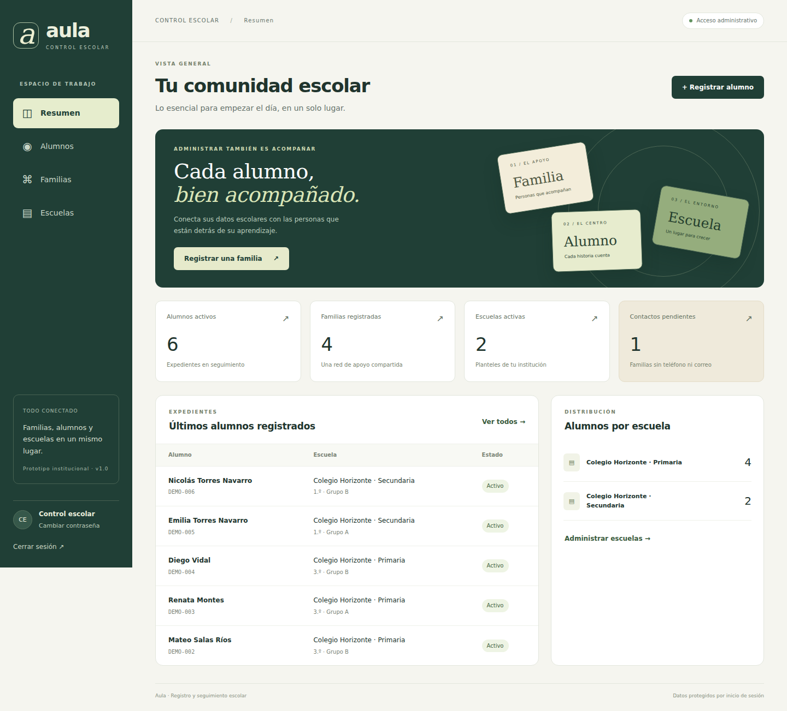

# Aula · Control escolar

Prototipo web para el equipo administrativo de una escuela o institución. Permite registrar alumnos, vincular hermanos con su misma familia, mantener contactos de padres, madres o tutores y organizar los expedientes por escuela.

Evolución del ejercicio **Reporte Escolar .NET** de Edgar Mendez: de una consulta de reporte a una aplicación ASP.NET Core MVC con persistencia en SQL Server, autenticación y operaciones completas.



## Qué puedes hacer

- Registrar, consultar, editar y eliminar alumnos, familias y escuelas.
- Registrar familias con padre, madre, tutor o cualquiera de sus combinaciones.
- Vincular varios hijos con una familia y asignar una escuela a cada alumno.
- Buscar por matrícula, alumno o responsable; filtrar por escuela y estado.
- Dar de baja a un alumno conservando su expediente como inactivo.
- Detectar familias sin teléfono ni correo desde el resumen.
- Exportar el reporte filtrado a CSV compatible con Excel.
- Iniciar sesión con una cuenta administrativa y cambiar su contraseña.

Las claves de escuela y matrículas son únicas. No se puede eliminar una familia o escuela con alumnos vinculados. Las ediciones simultáneas detectan conflictos para evitar sobrescribir cambios.

## Empezar en Windows

Necesitas el **SDK de .NET 10** y una instancia de **SQL Server** iniciada. SSMS sirve para administrar SQL Server; la aplicación se conecta directamente al motor.

1. Descarga este repositorio con **Code → Download ZIP**, extrae el ZIP y abre PowerShell en esa carpeta.
2. Prepara la base y crea tu cuenta:

   ```powershell
   .\scripts\preparar.ps1 -ConDatosDemo
   ```

   El script pide tu correo y una contraseña. Si en SSMS te conectas a una instancia con nombre, usa exactamente ese nombre:

   ```powershell
   .\scripts\preparar.ps1 -Servidor '.\SQLEXPRESS' -ConDatosDemo
   ```

3. Ejecuta la aplicación:

   ```powershell
   .\scripts\iniciar.ps1
   ```

   Abre **http://localhost:5109** e inicia sesión con la cuenta que creaste. Mantén abierta la terminal mientras utilizas la web.

La preparación crea **EscuelaControlDB**, una base nueva. No importa ni modifica tu antigua **EscuelaDB**. Los ejemplos son ficticios: dos escuelas, cuatro familias y seis alumnos. Omite `-ConDatosDemo` para empezar vacío. No hay contraseña predeterminada en el repositorio.

**Visual Studio:** abre `EscuelaControl.sln`, selecciona `EscuelaControl` como proyecto de inicio y usa el perfil `http`. Consulta [la guía de instalación](docs/INSTALACION.md) para HTTPS, errores de conexión y ejecución manual.

## Recorrido de demostración

1. Inicia sesión y observa los indicadores del resumen.
2. Crea una escuela y después una familia con sus datos de contacto.
3. Abre la ficha familiar y pulsa **Agregar alumno**. Agrega un segundo hijo para mostrar la relación entre hermanos.
4. Filtra los alumnos por escuela y descarga el reporte CSV.
5. Edita un alumno y desmarca **Alumno activo** para registrar una baja sin perder su información.

## Tecnología y estructura

| Parte | Implementación |
| --- | --- |
| Aplicación | C# / ASP.NET Core MVC 10 / Razor |
| Persistencia | Entity Framework Core 10 / SQL Server |
| Acceso | ASP.NET Core Identity y cookies |
| Interfaz | CSS propio adaptable a escritorio y móvil, sin CDN |
| Pruebas | xUnit, validaciones y pruebas HTTP con SQL Server real |

```text
src/EscuelaControl/      Aplicación MVC
  Controllers/          Flujos web
  Data/Migrations/      Esquema versionado e inicialización
  Models/               Entidades y relaciones
  ViewModels/           Formularios y resultados de consulta
  Services/             Exportación CSV
  Views/                Pantallas Razor
  wwwroot/              Estilos e interacción del navegador
tests/                  Pruebas unitarias y de integración
database/               Scripts SQL para consultar o preparar desde SSMS
scripts/                Preparación y arranque en Windows
docs/                   Instalación, arquitectura y validación
```

## Compilar y probar

```bash
dotnet restore
dotnet build --no-restore
dotnet test --no-restore
```

Las pruebas de integración se ejecutan cuando existe `TEST_SQL_CONNECTION`. Cada prueba crea una base temporal con nombre `AulaTests_<id>` y elimina únicamente esa base. Sin la variable se omiten explícitamente; las pruebas de validación y CSV sí se ejecutan. Consulta [VALIDACION.md](docs/VALIDACION.md).

## Alcance de esta versión

Es un prototipo de control de expedientes para una institución con uno o varios planteles. La cuenta administrativa puede ver todos los registros. No incluye calificaciones, asistencia, pagos, portal de padres, recuperación de contraseña por correo ni historial de ciclos escolares.

El código se comparte en GitHub; la aplicación se ejecuta en tu equipo o en un servidor compatible con ASP.NET Core y SQL Server. GitHub Pages no ejecuta este backend. Para un uso institucional con datos reales, configura HTTPS, una cuenta SQL con permisos limitados, respaldos y las reglas de acceso de la institución. [Arquitectura y despliegue](docs/ARQUITECTURA.md).
