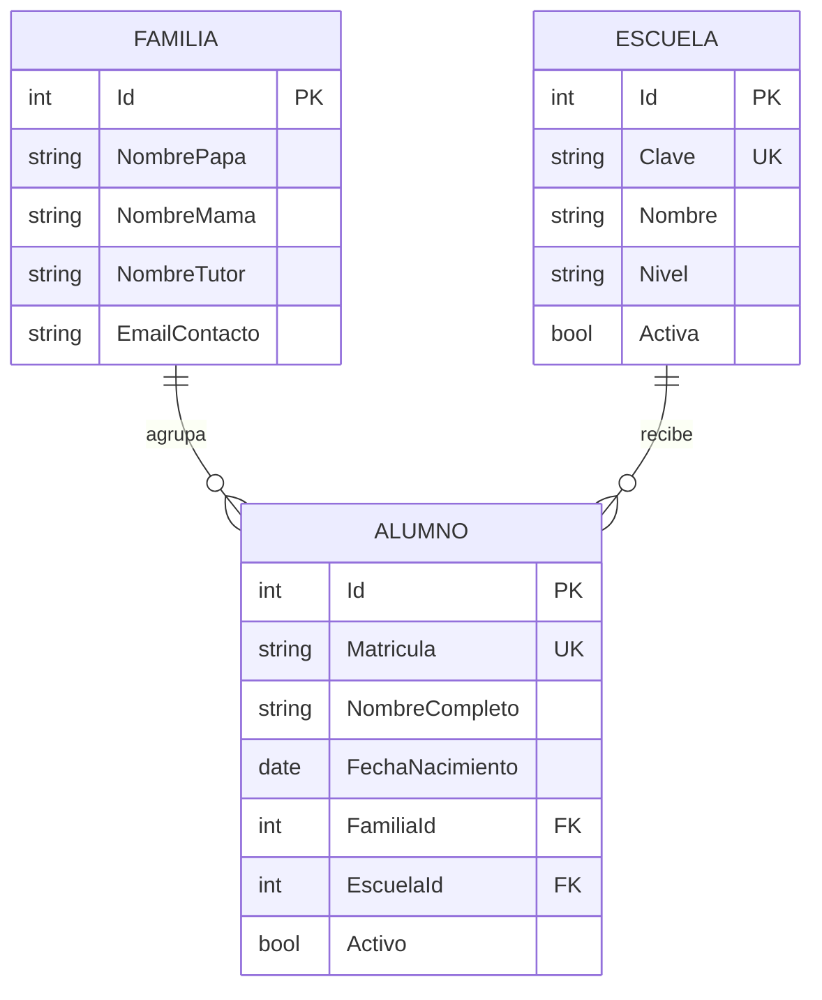

# Arquitectura y decisiones

## Modelo de dominio

Una **familia** agrupa los contactos del padre, madre y/o tutor. Debe tener al menos un responsable. Un **alumno** pertenece a una familia y a una escuela; varios hermanos comparten el mismo registro familiar. Una **escuela** representa un plantel o institución dentro del alcance de la aplicación.



Las tres entidades tienen fecha de creación, fecha de actualización y un identificador de versión para concurrencia. Estos campos no constituyen una bitácora completa: no guardan cada valor anterior ni identifican al autor de cada cambio.

## Separación de responsabilidades

- **Controllers:** reciben solicitudes, aplican reglas del flujo y devuelven vistas o archivos.
- **ViewModels:** limitan los campos editables y validan los formularios. Las entidades no se enlazan directamente desde una solicitud.
- **Models / DbContext:** relaciones, índices únicos, restricciones de eliminación y persistencia.
- **Views:** presentan datos con el escape HTML de Razor y formularios con token antifalsificación.
- **CsvExporter:** escapado de CSV y neutralización de fórmulas al abrir en una hoja de cálculo.

Se usa Entity Framework directamente desde los controladores para mantener un proyecto pequeño y comprensible. No se añadió un repositorio genérico que repita los métodos de `DbContext`.

## Integridad y acceso

- Índices únicos para matrícula y clave de escuela, además de mensajes de validación antes de guardar.
- Claves foráneas con eliminación restringida. No se borran hijos de forma implícita al eliminar una familia o escuela.
- Validación de responsables, contactos, fechas de nacimiento y referencias existentes.
- No se asignan nuevos alumnos a una escuela inactiva. Los alumnos ya vinculados conservan su relación.
- Token de concurrencia `Guid`: una edición con versión antigua no sobrescribe otra más reciente.
- ASP.NET Core Identity almacena hashes de contraseña. La sesión expira tras 30 minutos de inactividad; cinco intentos incorrectos bloquean temporalmente la cuenta durante diez minutos.
- Las consultas y exportaciones requieren sesión. Todas las acciones de escritura requieren token antifalsificación.
- Redirecciones de inicio de sesión restringidas a rutas locales, encabezados de seguridad y respuestas sensibles con `Cache-Control: no-store`.
- No existe registro público de cuentas ni contraseña compartida en el código.

## Alcance institucional

La versión 1 tiene un acceso administrativo común. Permite varios planteles, pero **no aísla los datos de instituciones distintas** por usuario. No debe desplegarse como servicio multiinstitución con clientes independientes sin añadir autorización y separación de datos.

La baja de un alumno se representa con `Activo=false`; su grado, grupo y escuela reflejan el estado actual. Un historial por ciclo escolar requeriría una entidad de inscripción separada.

## Despliegue fuera del equipo

Publicación del backend:

```bash
dotnet publish src/EscuelaControl -c Release -o artifacts/publicacion
```

Usa un servidor compatible con .NET 10 (por ejemplo IIS con Hosting Bundle o un servicio ASP.NET Core). Configura antes de iniciar:

| Configuración | Finalidad |
| --- | --- |
| `ASPNETCORE_ENVIRONMENT=Production` | Activar el comportamiento de producción. |
| `ConnectionStrings__EscuelaDB` | Conexión a la base institucional mediante secretos del servidor. |
| `AllowedHosts` | Nombre real del sitio; el valor del repositorio solo permite localhost. |
| HTTPS y certificado | Las cookies en producción requieren HTTPS. |
| Claves de Data Protection persistentes | Conservar sesiones y tokens al reiniciar o usar varias instancias. |

Aplica las migraciones y crea la primera cuenta en una tarea de preparación con permisos suficientes. Para la ejecución habitual, utiliza una identidad SQL limitada a los permisos de lectura/escritura requeridos sobre esta base. Separa las credenciales de mantenimiento de las de la web.

Configura el proxy de confianza y los encabezados reenviados según el alojamiento elegido si TLS termina en un proxy. El repositorio no acepta automáticamente encabezados de proxies arbitrarios. Antes de incorporar datos reales, define respaldos, restauración, acceso del personal y conservación de los registros con la institución.

Esta entrega contiene el proyecto y su instalación local; no aprovisiona ni paga un alojamiento público.
